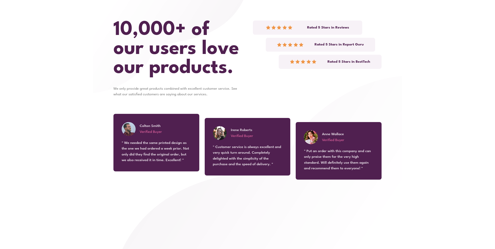

# Frontend Mentor - Social proof section solution

This is a solution to the [Social proof section](https://www.frontendmentor.io/challenges/social-proof-section-6e0qTv_bA/hub). Frontend Mentor challenges help you improve your coding skills by building realistic projects.

## Table of contents

- [Overview](#overview)
  - [Screenshot](#screenshot)
  - [Links](#links)
- [My process](#my-process)
  - [Built with](#built-with)
- [Author](#author)

## Overview

### Screenshot

### Links

- Solution URL: [Solution](https://github.com/ZTanvir/fem-social-proof-section)
- Live Site URL: [live Site](https://ztanvir.github.io/fem-social-proof-section/)

## My process

### Built with

- Semantic HTML5 markup
- CSS custom properties
- Flexbox
- CSS Grid
- Mobile-first workflow

## Author

- Github - [Zahirul Islam Tanvir](https://github.com/ZTanvir)
